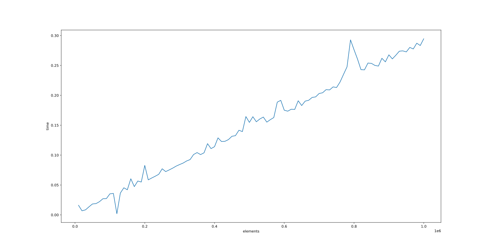

# TP-HSE-2022-HW

[](https://github.com/evgenius1544/tp-hse-2022-hw/actions/workflows/test_action.yml)

## Usage

- Install dependencies
```shell
pip3 install -r requirements.txt
```

- Run application
```shell
python3 -m app.main ./app/test_my_own_values.txt 
```

- Run tests
```shell
python3 -m app.test
```

- Run generator for speed test
```shell
python3 -m app.test_generator
```

- Run tests for checking work time dependence of elements
```shell
python3 -m app.test_work_time
``` 

> Graph of the dependence of the execution time on the number of numbers in the file;

`x - elements, y - time`



## Results
- Realised tests for all function: min, max, sum, mult. 
- Also created own test for reading function.
- Used type hint, read doc strings and used python standard library: functools, unittest, os, sys.
- Processed some actions in friendly form when user don't upload file or file doesn't exist.
- Created own test generator.
- Built graph of the dependence time and elements.
- Run tests in GitHub Actions.
- Run tests automatically by commit.
- Added badge.
- Added bot notification.
